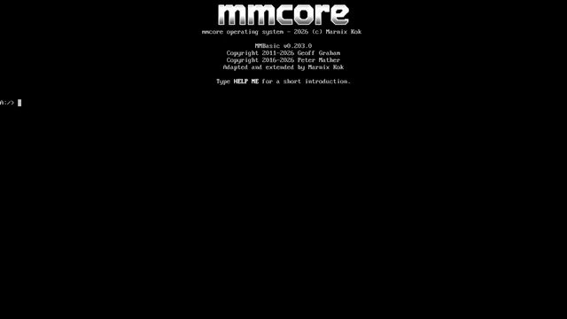
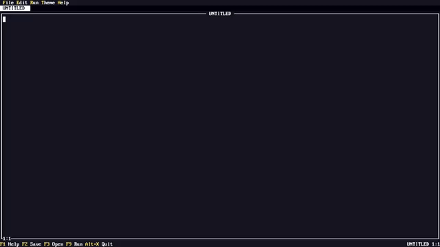
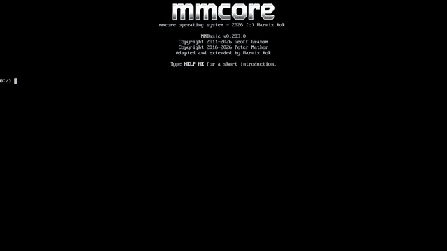
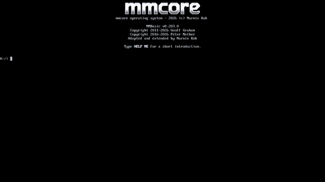

# mmcore

A modern take on a capable keyboard-based operating system that wraps itself
around the amazing **MMBasic** compiler. It will turn your Raspberry Pi into a
machine that boots you into the prompt in just a few seconds; but it also runs
on Linux, macOS and Windows.

## Built-in apps

mmcore ships a set of full-screen tools you can reach from the prompt. Type the
command, or open the `APPS` launcher (`Ctrl+Space`) to pick from the list.

<table>
  <tr>
    <td align="center" width="33%">
      
       <strong>Basic prompt</strong>
    </td>
    <td align="center" width="33%">
      
       <strong>Editor</strong>
    </td>
    <td align="center" width="33%">
      
       <strong>Files</strong>
    </td>
  </tr>
  <tr>
    <td align="center" width="33%">
      
       <strong>Help</strong>
    </td>
    <td align="center" width="33%">
      
       <strong>Juke</strong>
    </td>
    <td align="center" width="33%">
      
       <strong>WordPad</strong>
    </td>
  </tr>
</table>

| App | Command | What it does |
| --- | --- | --- |
| Editor | `EDIT` | Colour TUI code editor with tabs, menus and syntax highlighting. |
| Terminal | `TERM` | Fullscreen telnet terminal with scrollback, search and session replay. |
| File manager | `FILES` | Dual-pane file browser that previews images, audio, fonts and text. |
| Word processor | `WORDPAD` | Typora-style markdown editor with a centred text column. |
| Paint | `PAINT` | Full-screen, mouse-driven pixel paint app in Dr. Halo style. |
| Jukebox | `JUKE` | Retro music player with a spectrum/VU visualiser and folder queues. |
| Package | `PACKAGE` | Guided wizard that zips a folder into a runnable `.APP`. |
| Help | `HELP` | Interactive QuickBASIC-style manual and keyword reference. |

## Install on a Raspberry Pi

1. Download the release zip for your board from the
   [**Releases** page](https://github.com/marnixk/mmcore/releases):
   `rpi3`, `pizero2`, `pizero2w`, or `pi400`.
2. Unzip it and, on Linux, write a card with the bundled helper
   (`sudo ./install-sdcard.sh --bootstrap --model rpi3 /dev/sdX`).
3. Put the card in the Pi, connect HDMI and a USB keyboard, and power on.
4. Watch it boot straight into the `>` prompt — no Linux underneath.

Full notes, manual formatting steps for macOS/Windows, and board-specific file
lists live in [`INSTALL.md`](INSTALL.md). On a desktop you can instead build the
native binaries (see [`DEVELOPMENT.md`](DEVELOPMENT.md)); prebuilt Linux and
Windows builds are attached to the Releases page.

## About MMBasic, PicoMite, CMM2 and Circle

The language is **MMBasic**, Geoff Graham's classic BASIC dialect. mmcore's
behavioural compatibility target is the **Colour Maximite 2 (CMM2)**, with
graphics-library equivalence as the priority. The interpreter source is the
**[PicoMite-fork](https://github.com/marnixk/PicoMite-fork)** (originally
targeting the RP2040/RP2350 Pico), whose language core has been ported onto
**[Circle](https://github.com/rsta2/circle)**, Rene Stange's C++ bare-metal
runtime for the Raspberry Pi (screen, USB, serial, timers, …).

The default build is a Raspberry Pi 3 `kernel8.img` (AArch64), which also runs
under QEMU. Hardware releases ship that same kernel for Pi Zero 2 / Zero 2 W,
plus a Pi 400 / Pi 4 `kernel8-rpi4.img`. The same interpreter also builds
natively for Linux, macOS and Windows.

See [`CONTRIBUTING.md`](CONTRIBUTING.md) to get started on the code.
